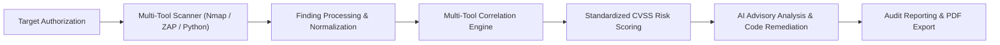

# AI-Powered Web Security Assessment Platform (WebSec AI)

> **Scan • Analyze • Secure**  
> An enterprise-grade, professional cybersecurity SaaS web platform for multi-tool web application vulnerability assessment, standardized risk scoring, finding correlation, and AI-guided remediation.

---

## 🛡️ Executive Summary & Workflow

WebSec AI provides a unified SecOps command center that bridges traditional scanning engines (Nmap, OWASP ZAP, Custom Python checks) with intelligent finding deduplication, CVSS v3.1 scoring normalization, and AI-assisted contextual remediation.



---

## 🚀 Key Features Implemented

### 1. Global Command Architecture & Layout
* **Navy Dark Sidebar**: Expandable/collapsible navigation, live risk badge counters, active tool indicators, and analyst identity signoff.
* **Top Navigation Bar**: Global search modal trigger (`Ctrl+K` / `⌘K`), notification center with unread counters & status dropdown, and analyst user menu.
* **Global Search (`⌘K`)**: Instant auto-complete search across authorized targets, open findings, scan jobs, and compliance reports.
* **Slide-Over Finding Details Drawer**: Inspect technical scanner evidence, vulnerability impact descriptions, CVSS breakdowns, and AI remediation code without losing table context.

### 2. Authentication & Access Control
* **Split-Screen Sign-In (`/login`)**: Cybersecurity grid branding, analyst credentials, and session management.
* **Account Registration (`/signup`)**: Legal terms and security testing policy acknowledgement.
* **Password Recovery (`/forgot-password`)**: Tokenized reset link flow with instant status feedback.

### 3. Central Security Dashboard (`/dashboard`)
* **6 Summary Metric Cards**: Total Scans (24), Total Findings (127), High Risk (18), Medium Risk (42), Low Risk (67), and Authorized Targets (8).
* **Security Findings Trend Line Chart**: Interactive SVG curve tracking daily vulnerability detections with hover tooltips and area gradient.
* **Risk Distribution Donut Chart**: Breakdown of findings by severity rating (Critical, High, Medium, Low, Informational).
* **Recent Scans Table & Quick Action Cards**: Direct navigation to scan creation, findings triage, reports, and target scopes.

### 4. New Assessment & Mandatory Authorization (`/scans/new`)
* **Target Specification**: Host URL, application name, environment tier (Staging, Development, Testing, Production), and scope notes.
* **Strict Authorization Confirmation**: Checkboxes certifying explicit permission to assess the target system; assessment action remains locked until confirmed.
* **Scanning Modules Configuration**: Selectable modules (Nmap Network Discovery, OWASP ZAP Web Security Scan, HTTP Security Headers, TLS Configuration, Information Leakage Checks, Custom Checks) and scan intensity tuning.
* **Pre-Scan Verification Modal**: Review target parameters, selected engines, and compliance status before launching.

### 5. Dynamic Scan Pipeline & Telemetry Stream (`/scans/[id]/progress`)
* **Large Circular Progress Indicator**: SVG animated progress percentage (e.g. 62%) with estimated remaining time.
* **6-Stage Sequential Pipeline**:
  1. *Nmap — Network Discovery*
  2. *OWASP ZAP — Web Security Testing*
  3. *Custom Security Checks*
  4. *Finding Processing & Normalization*
  5. *Multi-Tool Risk Correlation*
  6. *AI Analysis & Remediation Generation*
* **Live Telemetry Stream**: Monospace terminal log box displaying real-time scanner standard out events.

### 6. Comprehensive Scan Results (`/scans/[id]`)
* **Results Summary Header**: Overall Risk rating (**HIGH** - 7.8/10), assessment duration, target parameters, and report export action.
* **6 Tabbed Panes**:
  1. **Overview**: Executive risk gauge, severity distribution, and top priority vulnerabilities.
  2. **Findings**: Multi-facet filterable findings table (Search, Severity, Source, Status) with drawer inspection.
  3. **Vulnerabilities**: Categorized vulnerability cards.
  4. **Risk Analysis**: Priority risk register.
  5. **AI Insights**: Contextual impact breakdown and step-by-step code fixes.
  6. **Raw Results**: Parsed Nmap XML and OWASP ZAP JSON alert dumps.

### 7. AI Security Analysis (`/ai-analysis`)
* **AI Transparency Notice**: Explicit disclaimer that AI analyzes confirmed security findings and does not independently perform vulnerability scanning.
* **Contextual Explanations**: Plain-language explanations of complex vulnerabilities.
* **Step-by-Step Remediation**: Verified code patches, configuration hardening directives, and defensive engineering practices.

### 8. Multi-Tool Risk Correlation Engine (`/risk-analysis`)
* **Root Cause Deduplication**: Connects disparate alerts from different tools (e.g., OWASP ZAP SQL injection + Custom Python database error disclosure) into a consolidated, high-fidelity security incident.

### 9. Formal Security Reports & Audit Previews (`/reports` & `/reports/[id]`)
* **In-App Formal Audit Preview**: Clean document sheet with executive summary, scope details, risk overview chart, detailed findings with technical proof, and AI remediation roadmap.
* **Print / Save as PDF**: Print-specific CSS stylesheet hiding UI controls and outputting clean stakeholder deliverables.

### 10. Centralized Findings & Target Management (`/findings` & `/targets`)
* **Findings Register**: Triage all discovered vulnerabilities across all assessments, update statuses (Open, In Review, Resolved, False Positive).
* **Authorized Targets Registry**: Track authorized hosts, environment tiers, and launch on-demand scans.

### 11. Workspace Settings (`/settings`)
* **Analyst Profile**: Personal details, role assignment, and active sessions.
* **Security & 2FA**: Two-factor authenticator app toggle and password updates.
* **Notification Preferences**: Configurable triggers for scan completions and critical alerts.
* **AI Provider Selection**: Configure advisory LLM model (GPT-4o, Claude 3.5 Sonnet, Local DeepSeek-R1 for air-gapped environments).
* **Documentation & Architecture Guide**: Overview of platform principles.

---

## 🛠️ Technology Stack

| Layer | Technology |
|---|---|
| **Framework** | Next.js 14 (App Router) |
| **Language** | TypeScript (Strict Mode) |
| **Styling** | Tailwind CSS with Cybersecurity Design Tokens |
| **Icons** | Lucide React |
| **Charts** | Custom Pure SVG Responsive Charts (No hydration lag) |
| **State Management** | React Context (`AppContext`) with persistable mock storage |

---

## 🔌 Future Backend Integration Architecture

The frontend is decoupled from scanning logic to enable future FastAPI backend connection:

```text
Frontend (Next.js / TypeScript)
    │
    ▼ REST API / WebSocket
FastAPI Gateway (Python 3.11+)
    ├── Scanning Orchestrator (Celery / Redis)
    │     ├── Nmap Engine (Network Discovery)
    │     ├── OWASP ZAP Daemon (Active Web Spidering)
    │     └── Python Custom Suite (Headers, TLS, IDOR Checks)
    ├── Normalization & Correlation Engine
    ├── PostgreSQL Database (Targets, Scans, Findings, Reports)
    └── AI Advisory Engine (OpenAI API / Claude / Local Ollama)
```

---

## 🏁 Getting Started

### Prerequisites
* Node.js 18.x or newer
* npm 9.x or newer

### Installation
```bash
# Clone or navigate to the project directory
cd "AI-Powered Web Security Assessment Platform"

# Install dependencies
npm install
```

### Development Server
```bash
npm run dev
```
Open [http://localhost:3000](http://localhost:3000) in your browser.

### Production Build
```bash
npm run build
npm run start
```
